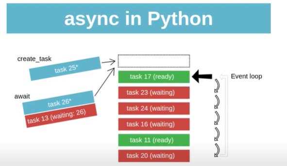

* https://www.youtube.com/watch?v=Mj-Pyg4gsPs


* Concurrency without threads

* do some stuff until you see the word `await` 
* stop there (at the place await happens, actually it "yilds" the 
  execution)
* continue with the rest after the await statement returns (potentially
  doing something with what was returned from the await statement)


* Some terminology: All of these are **the things you can wait for**, by which we mean something that can go off and run, until we get some result back from it. 
    * coroutines: 
    * futures: 
    * tasks: a more high-level concept for coroutines and futures. 

* Event Loop: is the thing that runs all these tasks, coroutines, and futures. That is, instead of we running them, as we do with normal functions, we give them to the event loop to run them. And that's how it manages to pause them, do some stuff in the middle, and then comeback later. So we cannot simply run these things on the normal Python interpreter, because the interpreter does not know how to pause things. 

* We write a **coroutine function** using **`async def`** keyword. This is essentially a function that is supposed to be run by the event loop instead of executed normally. 
    * **Inside** any coroutine function, we definitively need to have the keyword **`await`**, because we want to wait for something. 
    * Obviously, we wouldn't need to have a coroutine function, if we were not going to wait for something to happen. 
    * The `await` keyword means, stop execution here, go do whatever you like, and come back later. 
    * The two keywords `async def` and `await` are actually the thing that make this function an coroutine. 

* If we run a coroutine function, it does not run. It creates a **coroutine object**, which is an object that potentially can be given to an **event loop**

```python 
>>> from asyncio_example import mycoro
>>> mycoro(3)
__main__:1: RuntimeWarning: coroutine 'mycoro' was never awaited
<coroutine object mycoro at 0x7f6262656af0>
>>> 
```

* They way to kick it off, is to pass it to the event loop:
    * using `asyncio.ensure_future(c)`
    * **Note that** it kicks the coroutine off and starts running it, as soon as we call `event_loop.run_until_complete()`! 

```python 
import asyncio


async def mycoro(number):
    print("Starting %d" % number)
    await asyncio.sleep(1)
    print("Finishing %d" % number)   # runs later
    return str(number)

# Note that it kicks the coroutine off and starts running it!!
c = mycoro(3)
task = asyncio.ensure_future(c)

# # or Python 3.7 above: 
# task = asyncio.create_task(c)

async def mycoro(number):
    print("Starting %d" % number)
    await asyncio.sleep(1)
    print("Finishing %d" % number)   # runs later
    return str(number)


c = mycoro(3)
task = asyncio.ensure_future(c)

# # or Python 3.7 above: 
# task = asyncio.create_task(c)

loop = asyncio.get_event_loop()
loop.run_until_complete(task)
loop.close()

```

* Combining tasks together with `asyncio.gather(mycoro(1), mycoro(2), mycoro(3)`.  Gather returns a future combining all the given coroutines. It runs all the given coroutines in parallel, and **returns results in the order of coroutines given**.

```python 
# ...
# ...

many = asyncio.gather(
    mycoro(3),
    mycoro(4),
    mycoro(5)
)


loop = asyncio.get_event_loop()
print("Running many:")
result = loop.run_until_complete(many)
print(result)
loop.close()

# Result:
#
# Running many:
# Starting 3
# Starting 5
# Starting 4
# Finishing 3
# Finishing 5
# Finishing 4
# ['3', '4', '5']
```

* Coroutines calling coroutines: 

```python 
async def f2():
    print("Start f2")
    await asyncio.sleep(1)
    print("Stop f2")


async def f1():
    print("Start f1")
    await f2()
    print("Stop f1")

# # We can also give coroutines directly to event loop
# # without creating a future from them.
# task = asyncio.ensure_future(f1())

loop = asyncio.get_event_loop()
loop.run_until_complete(f1())
loop.close()

# Result: 
# 
# Start f1
# Start f2
# Stop f2
# Stop f1

```

* async context manager: It is like the normal context manager, but waits creation of the context it is managing: 

```python 
    async with ClientSession() as s, s.get(url) as res:
        ret = await res.read()
        print(f"Received {len(ret)} bytes of response")
        return ret
```

* `asyncio.as_complete()` runs some code whenever it gets back any result (instead of like `gather()` it waits for all the results)


## Think about it like this:

* Theres is a stack of things (tasks) in the event loop, that are either waiting or are ready to be run. 

* Those who are ready, are those that what ever that they were waiting for, is no more blocking them. So their execution can continue. For example the OS has gone to the network, and pulled some stuff from the network and now the function can continue its work with those stuff. 

* Those that are waiting are those for whom the IO (or whatever they were waiting for) is not finished yet, and they are waiting for it. 

* Now event_loop loops over the things it has got in its stack. For any of them that is ready, it picks it and runs the code until it blocks. 

* Now, the `ensure_future()` or `create_task()` (in Python 3.7 >), puts a task in this list of tasks. 

* The `await` keyword, puts a task in waiting state, until the thing it is waiting for is finished and returns. 

* **IMPORTANT:** now the important thing here is, that if you write code that does not wait for something (**does not do an AWAIT**), and does take long to execute (e.g. a CPU bound computation), this will block all others. E.g. if you do a busy loop in one your tasks, it will stop the program, because **there is only one thread running at a time**: This is the **event_loop thread** that pulls bits of code from these tasks, runs them until they block, and then it goes off running something else. Now if one of these tasks runs forever and never `await`s, then the even loop only runs it. 

* So, the thing that is running here in parallel is the (mostly IO) things that OS does and those coroutines (tasks, futures) are waiting for. 

* So the good thing about asyncio is that the thing that is running in parallel are not in your code. So you don't need to deal with the hard stuff of managing the threads and their modification of the same shared thing at different times. There is only one thread running (which is the event_loop thread), which runs bits of code from tasks and that are done with their IO and are ready to be run. 



